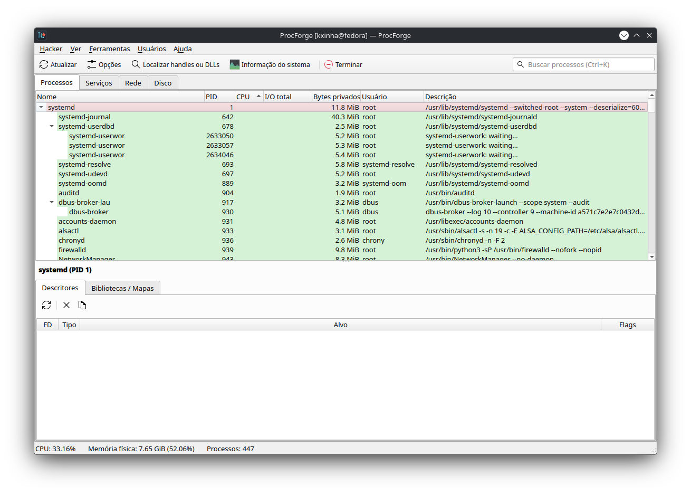
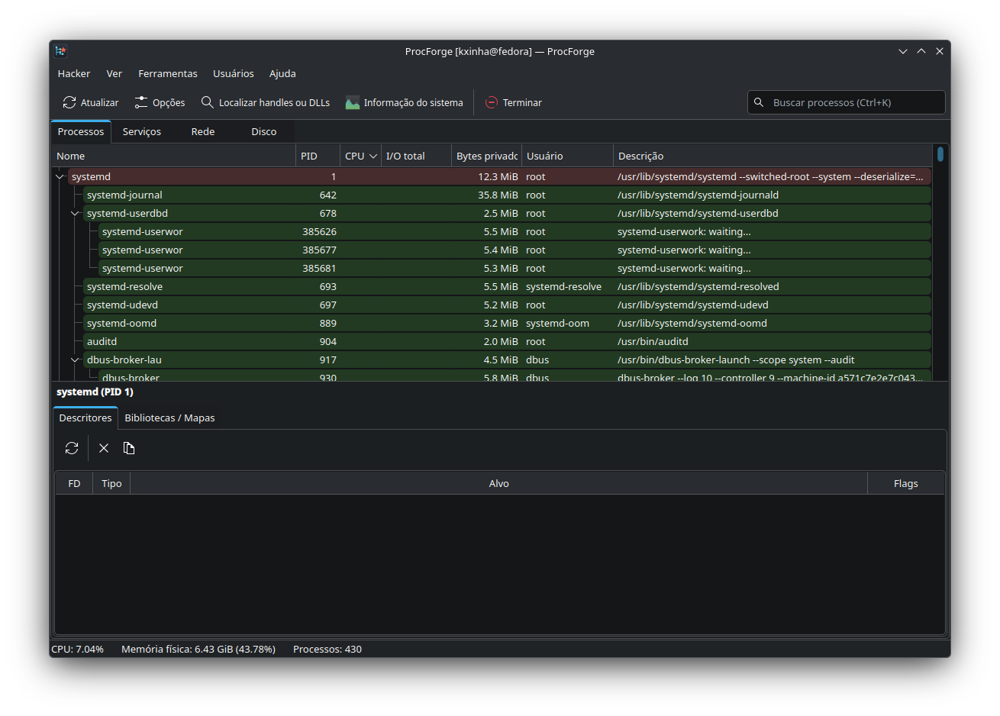
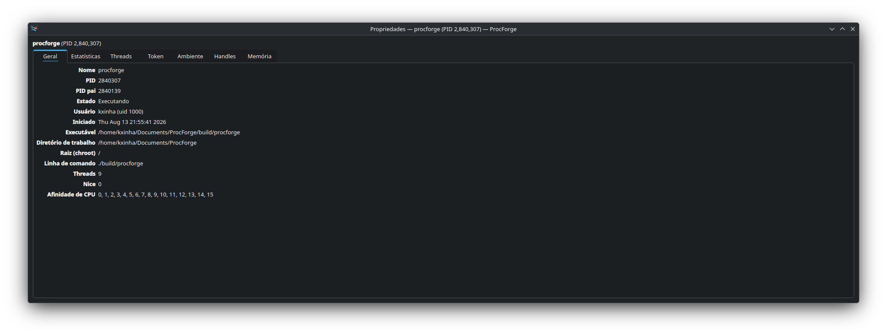
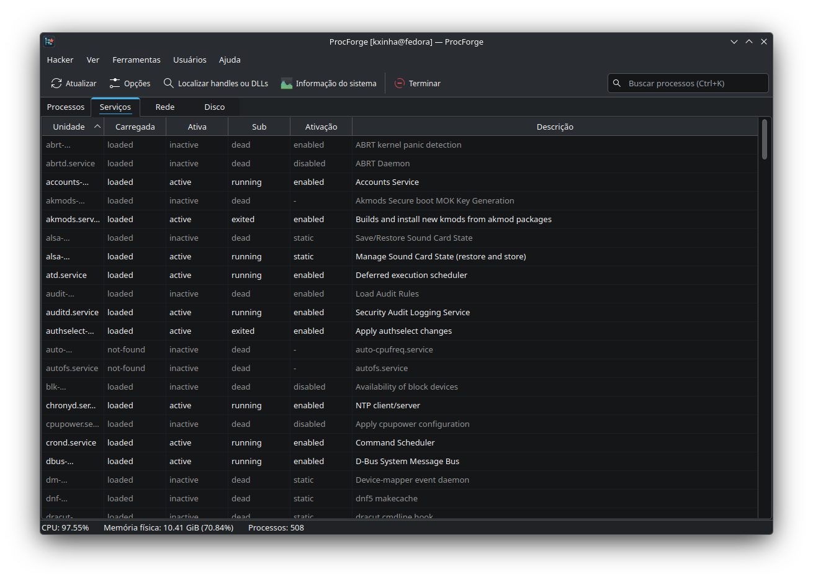

<div align="center">

# ⚒️ ProcForge

**Um clone do [Process Hacker / System Informer](https://systeminformer.sourceforge.io/) para Linux — nativo, respeitando as primitivas do sistema.**

Não é um visualizador. É uma ferramenta de **manipulação e controle ativos** do sistema em tempo real: matar, suspender, congelar, reescrever memória, injetar bibliotecas, estrangular CPU/RAM/disco, fechar descritores alheios, rastrear com eBPF e mais — tudo sobre APIs estáveis do Linux (`procfs`, `pidfd`, `ptrace`, `process_vm_*`, `cgroups v2`, `netlink`, `eBPF`), com GUI Qt6 / KDE Frameworks 6 em **Wayland puro**.



</div>

> ⚠️ **Aviso.** O ProcForge dá a você poder real sobre processos em execução: escrever na memória de outro programa, injetar código, fechar travas, limitar recursos e matar árvores inteiras. Use **na sua própria máquina** e com responsabilidade. Toda ação privilegiada (uid alheio / root) passa por um diálogo do **polkit**; a GUI **nunca** roda como root.

---

## Índice

- [Por que existe](#por-que-existe)
- [Capturas de tela](#capturas-de-tela)
- [Funcionalidades](#funcionalidades)
- [Instalação](#instalação)
  - [Instalação num comando (curl)](#instalação-num-comando-curl)
  - [Pacote RPM (Fedora / Nobara / Bazzite)](#pacote-rpm-fedora--nobara--bazzite)
  - [A partir do código-fonte](#a-partir-do-código-fonte)
- [Requisitos](#requisitos)
- [Arquitetura e segurança](#arquitetura-e-segurança)
- [Como usar](#como-usar)
- [Idiomas e temas](#idiomas-e-temas)
- [Estado do projeto](#estado-do-projeto)
- [Licença e créditos](#licença-e-créditos)

---

## Por que existe

No Windows, o Process Hacker precisa de um **driver em kernel mode** porque o SO nega ao usuário esse nível de manipulação. No Linux, esse poder **já é do usuário no espaço de usuário** — está só espalhado e cru entre `kill`, `gdb`, `scanmem`, `renice`, `ss`, `nsenter`, `bpftrace`. O ProcForge não conquista acesso: ele dá **uma interface gráfica coerente e ação direta** a esse poder, e em vários pontos **vai além** do que o Process Hacker jamais conseguiu no Windows (cgroups como bisturi de recursos, eBPF por processo, namespaces/containers, janelas via KWin scripting).

## Capturas de tela

| Tema Clássico (cara do Process Hacker) | Tema escuro (Breeze) |
|---|---|
|  |  |

| Inspetor de propriedades (7 abas) | Aba de Serviços (systemd) |
|---|---|
|  |  |

## Funcionalidades

**Lista de processos**
- Árvore ao vivo com atualização **quase instantânea** via eventos `cn_proc` (fork/exec/exit em push, sem polling perceptível).
- Colunas do Process Hacker (Nome, PID, CPU, I/O total, Bytes privados, Usuário, Descrição), com **cores por categoria** (verde=serviço, rosa=root, ciano=seu, cinza=suspenso, amarelo=kernel, flash verde=novo) e **ícone por processo** (ícone real do app via `.desktop`, com fallback de sistema).
- Busca/filtro, ordenação, e **inspetor de propriedades** (duplo-clique): abas **Geral, Estatísticas** (ao vivo), **Threads** (suspender por thread), **Token** (uid/gid, *capabilities* decodificadas, seccomp, SELinux), **Ambiente**, **Handles** (fds), **Memória** (maps).

**Manipulação de processos**
- Sinais graduados (TERM/KILL/STOP/CONT/…) via **pidfd** (imune a reuso de PID).
- Suspender/retomar, **matar árvore inteira**, renice, afinidade de CPU.
- **Escalonamento** (SCHED_OTHER/BATCH/IDLE/FIFO/RR), **ionice**, **prlimit** ao vivo.
- **Suspender/retomar uma thread individual** (ptrace por TID).
- **Executar como…** (Run as): **cria um novo processo** como outro usuário, com diretório de trabalho, *nice* e afinidade — o ProcForge não só manipula o que existe, ele **cria e controla** processos.

**Memória (estilo Cheat Engine / scanmem)**
- Scanner de valor com busca exata, **refinamento** (mudou/não mudou/aumentou/diminuiu/…), **congelamento de valor** (reescrita em loop) e **editor hexadecimal**.
- Leitura/escrita via `process_vm_readv/writev`.
- **Manipulação de páginas** (o "Protect…/Free" do PH): **alocar** (`mmap`), **mudar proteção R/W/X** (`mprotect`) e **liberar** (`munmap`) regiões do alvo — executado *dentro* do processo por chamada remota de função libc via ptrace.

**Injeção e descritores**
- **Injeção de biblioteca** (`dlopen` forçado via ptrace) — a "injeção de DLL" do Linux.
- Aba de **descritores**: fechar um fd de outro processo (injeta `close()`) — o truque do *singleton* — e duplicar via `pidfd_getfd`.

**cgroup-bisturi (além do Windows)**
- Limite **ao vivo** de **CPU %, RAM, PIDs e I/O de disco** de um processo, sem reiniciá-lo. Restaura ao scope de origem ao remover.

**eBPF, namespaces e janelas**
- **eBPF por processo** (via bpftrace): contagem de syscalls, arquivos abertos, conexões TCP.
- **Namespaces/containers**: inspeção de `/proc/PID/ns` e **rodar um comando dentro** dos namespaces do alvo (`setns`).
- **Janelas** (Wayland): trazer para frente, minimizar, restaurar, fechar via **KWin scripting**.

**Abas de sistema**
- **Serviços** (systemd): iniciar/parar/reiniciar/recarregar, **habilitar/desabilitar**, **mascarar/desmascarar**, status/journal.
- **Rede** (`ss`): matar o dono da conexão, **fechar a conexão** (`ss -K`), ir para o processo.
- **Disco**: throughput por dispositivo.

**Interface**
- Qt6 / KDE Frameworks 6, **Wayland puro**, **pt-BR e en_US**, temas **Sistema / Claro / Escuro / Clássico (Process Hacker)**, tabelas ordenáveis e estáveis (sem "pulo" ao atualizar).

## Instalação

### Instalação num comando (curl)

Cola num terminal Linux (Fedora / Nobara e derivados). O script instala as dependências, compila e instala a GUI (no seu usuário) e o helper privilegiado (via `sudo`):

```bash
curl -fsSL https://raw.githubusercontent.com/gabrielmf1998/ProcForge/main/install.sh | bash
```

Alternativa pelo GitLab:

```bash
curl -fsSL https://gitlab.com/gabriel17166/ProcForge/-/raw/main/install.sh | bash
```

Depois é só abrir **ProcForge** no menu, ou rodar `procforge`.

### Pacote RPM (Fedora / Nobara / Bazzite)

Baixe o `.rpm` da página de [Releases](https://github.com/gabrielmf1998/ProcForge/releases) e:

```bash
# Fedora / Nobara (tradicional)
sudo dnf install ./procforge-*.rpm

# Bazzite e outros atômicos (rpm-ostree) — requer reboot
rpm-ostree install ./procforge-*.rpm && systemctl reboot
```

### A partir do código-fonte

```bash
git clone https://github.com/gabrielmf1998/ProcForge.git
cd ProcForge
./install.sh            # instala deps, compila e instala tudo
# ou manualmente:
cmake -B build -G Ninja && cmake --build build
QT_QPA_PLATFORM=wayland ./build/procforge          # rodar sem instalar
pkexec ./install-helper.sh                          # instalar só o helper privilegiado
```

## Requisitos

**Para compilar** (o `install.sh` instala tudo via `dnf`):

- `cmake` (≥ 3.20), `ninja-build`, `gcc-c++` (C++20), `extra-cmake-modules`, `gettext`
- Qt6: `qt6-qtbase-devel`
- KF6: `kf6-kcoreaddons-devel`, `kf6-ki18n-devel`, `kf6-kwidgetsaddons-devel`

**Em execução:**

- **KDE Plasma 6 em Wayland** (o controle de janelas usa o KWin scripting) e Qt6/KF6.
- `polkit` (autorização das ações privilegiadas) e `systemd` (ativação do helper).
- Para funcionalidades específicas: `bpftrace` (eBPF), `iproute` (`ss`, aba Rede), `util-linux` (`nsenter`), `libcap` (`capsh`, aba Token).
- **Opcional:** `rust` + `cargo` — se presentes na hora de compilar, o núcleo de leitura/escrita de memória do helper é construído em **Rust** (memória segura). Sem eles, usa o caminho em C++ (idêntico em função).

## Arquitetura e segurança

Dois binários, um barramento, **política por poder concedido**:

- **`procforge`** — a GUI, roda **como você, sem privilégio**. Faz o caminho rápido direto (mesmo uid); no `EPERM` ou ação intrinsecamente privilegiada, chama o helper por D-Bus (**assíncrono** — a janela não congela no diálogo de senha).
- **`procforged`** — helper D-Bus de sistema, **ativado sob demanda**, roda como root e **reduz imediatamente para capabilities mínimas + seccomp** (sandbox da unit systemd). Idle-exit. **Cada método = uma action polkit distinta** (matar-alheio, escrever-memória, fechar-fd, injetar-lib… são autorizações separadas). Valida identidade do alvo por `(pid, starttime)` (anti-reuso) e audita tudo no journald.

O split resolve a segurança de memória de forma limpa: quem escreve na memória alheia é o **helper**, que não tem Qt — pode ser (e é, quando há toolchain) **Rust puro**, exatamente onde a garantia paga.

## Como usar

- **Botão direito** num processo: sinais, suspender, matar árvore, prioridade/afinidade/escalonamento, **Scanner de memória**, **Injetar biblioteca**, **Limitar recursos (cgroup)**, **eBPF**, **Namespaces**, **Janela**, **Propriedades**.
- **Duplo-clique**: abre o inspetor de **Propriedades** (7 abas).
- **Abas** no topo: Processos, Serviços, Rede, Disco.
- Ações em processos de **outro usuário/root** disparam o **diálogo do polkit**.

## Idiomas e temas

- **Ver › Idioma**: Automático / Português (Brasil) / English (US) — reinicia para aplicar.
- **Ver › Tema**: Sistema (Breeze) / Claro / Escuro / **Clássico (Process Hacker)** — ao vivo. O tema Clássico reproduz o visual do Process Hacker do Windows.
- Também em **Hacker › Opções**.

## Estado do projeto

Projeto pessoal, funcional e em evolução. Fases 0→4 completas (lista de processos e manipulação, helper D-Bus + polkit, scanner de memória, injeção + cgroup + eBPF + namespaces + cn_proc + janelas). Débitos técnicos e ideias em [`docs/STATUS.md`](docs/STATUS.md).

## Licença e créditos

- **Licença:** [GPL-3.0-or-later](LICENSE). Código **original**, escrito para Linux.
- **Inspiração:** [Process Hacker / System Informer](https://systeminformer.sourceforge.io/) (Wen Jia Liu / winsiderss), sob GPL — um projeto excelente. O ProcForge **não** é afiliado nem contém código dele; é uma reimplementação independente, traduzindo a filosofia da ferramenta para as primitivas nativas do Linux.
- Construído com **Qt6** e **KDE Frameworks 6**.
